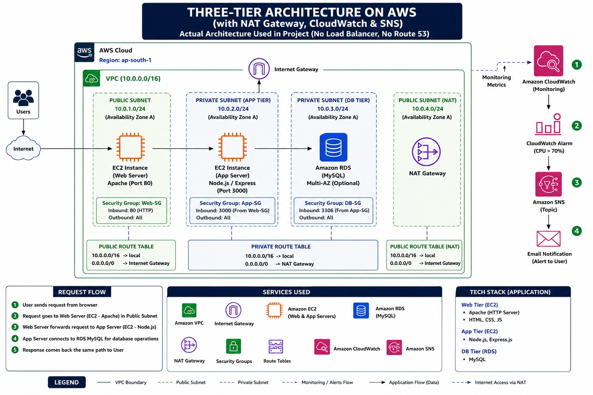

# 🚀 AWS Three-Tier Architecture on AWS


---

## 📌 Project Overview

This project demonstrates a **Production-Style AWS Three-Tier Architecture** deployed on **Amazon Web Services (AWS)**.

The infrastructure is divided into three independent layers:

- 🌐 Web Tier (Apache Web Server)
- ⚙️ Application Tier (Node.js Backend)
- 🗄️ Database Tier (Amazon RDS MySQL)

The application is deployed inside a custom VPC using secure networking principles with monitoring and alerting enabled through CloudWatch and Amazon SNS.

---

# 🏗️ Architecture Diagram



---

# 📐 Architecture Flow

```
Internet
    │
Internet Gateway
    │
Public Subnet
    │
Apache Web Server (EC2)
    │
Private Subnet
    │
Node.js Application (EC2)
    │
Amazon RDS (MySQL)

CloudWatch
     │
Amazon SNS
     │
Email Notification
```

---

# ☁️ AWS Services Used

- Amazon EC2
- Amazon VPC
- Public & Private Subnets
- Internet Gateway
- NAT Gateway
- Route Tables
- Security Groups
- Amazon RDS (MySQL)
- CloudWatch
- Amazon SNS
- IAM
- EC2 Instance Connect Endpoint
- Apache2
- Ubuntu Linux
- PM2

---

# ✨ Features

- Production Style Three-Tier Architecture
- Secure Networking
- Public & Private Subnets
- Apache Web Server
- Node.js Backend
- Amazon RDS Database
- PM2 Process Manager
- CloudWatch Monitoring
- SNS Email Alerts
- Booking API Integration
- Secure Security Groups

---

# 📂 Project Structure

```
aws-three-tier-architecture
│
├── architecture
│   └── architecture-diagram.png
│
├── screenshots
│
├── README.md
```

---

# 🚀 Deployment Workflow

1. Created Custom VPC
2. Configured Public & Private Subnets
3. Created Internet Gateway
4. Configured NAT Gateway
5. Launched EC2 Instances
6. Installed Apache Web Server
7. Deployed Node.js Backend
8. Configured PM2
9. Created Amazon RDS Database
10. Connected Backend with Database
11. Configured CloudWatch Monitoring
12. Configured Amazon SNS Email Alerts
13. Tested Booking API
14. Verified Frontend & Backend Integration

---

# 📸 Deployment Screenshots

## 1. VPC Created


## 2. EC2 Instances Overview


## 3. Web Server Instance Connection


## 4. App Server Instance


## 5. PM2 Installed


## 6. Backend Running


## 7. Booking API Success


## 8. Amazon RDS


## 9. NAT Gateway


## 10. EC2 Instance Connect Endpoint


## 11. CloudWatch Alarm


## 12. CloudWatch Email Alert


## 13. Frontend Homepage


## 14. Online Booking Form


## 15. Frontend & Backend Integration


---

# 📚 Learning Outcomes

- AWS VPC Networking
- EC2 Deployment
- Apache Web Server
- Linux Administration
- Node.js Deployment
- PM2 Process Management
- Amazon RDS Integration
- CloudWatch Monitoring
- Amazon SNS Notifications
- Infrastructure Troubleshooting

---

# 🔮 Future Improvements

- Application Load Balancer
- Auto Scaling Group
- Route 53 Domain
- HTTPS using ACM
- Docker Deployment
- Terraform Automation
- CI/CD Pipeline using GitHub Actions

---

# 👨‍💻 Author

**Krishna Gupta**

Cloud Computing & AWS Enthusiast

⭐ If you like this project, don't forget to Star the repository.
